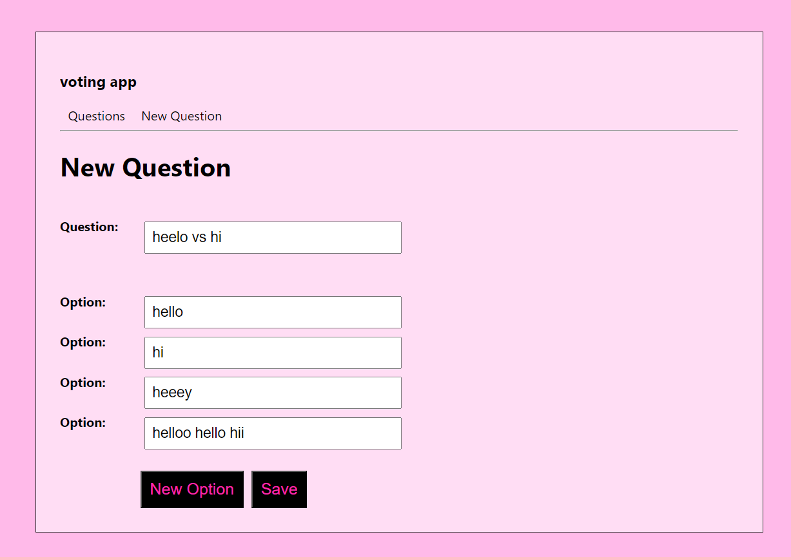

# GraphQL Voting App with Hasura :heart:

This project assignment has been prepared for the 'Kodluyoruz' GraphQL course.The questions added to the system are listed, and votes can be cast from the question detail page. It can be seen how many votes have been given to each option. A new question can be added to the system. a sample voting app with hasura

---

